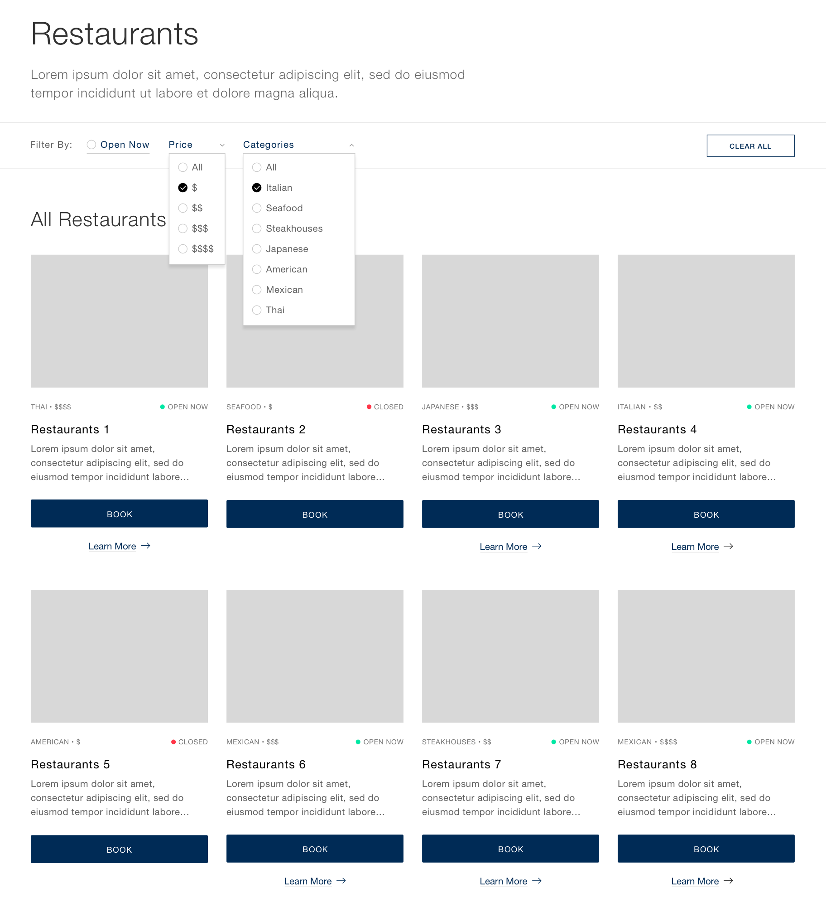

# Superformula Front-end Developer Coding Test

Be sure to read **all** of this document carefully, and follow the guidelines within.

## Context

Use React w/ TypeScript to implement the following mock-up. You will need to leverage an open API for restaurant data to fill in the details and functionality as described below. You are only required to complete the desktop views, unless otherwise instructed.



Use this Figma file to see button states, colors, and responsive design.  You should be sure to complete the test to mimic the design as seen.

> [Source Figma file](https://www.figma.com/file/4MqQhKPsnKetTud9tm6kDY/Superformula-FE-test-264388d?node-id=0%3A1)

## Requirements

### Yelp API

You can ask us and we will provide you a Yelp API Key to use for your PR.

> NOTE: Yelp's API does not allow CORS. To get around this, you will need to setup a local proxy with CORS support and proxy your requets to Yelp's endpoints.

### Page Structure

```
Main
  - Filter navigation
    - Open now (client side filter)
    - Price (client side filter)
    - Categories/Cuisines (server side search filter)
  - Section
    - Restaurant item
      - Image (use first item in `photos`)
      - Cuisine / Categories (use first item in `categories`)
      - Rating
      - Price range
      - Open / Closed
      - Restaurant name
      - Learn more (navigate to Detail View)
Detail View
  - Restaurant Name & Rating
  - Map (optional, if time allows)
  - Section
    - Review item
      - Image
      - Name
      - Rating
      - Text
```

### Functionality

- The filter navigation needs to be able to perform real time filtering on both client side data, as well as server side queries.
- Yelp's `/businesses/search` endpoint requires a `location`, please use `Las Vegas`
- `Categories` can be pre-filled from the [Categories endpoint](https://www.yelp.com/developers/documentation/v3/all_categories)
- The items should always show 4-6 items per row depending on viewport size. Use your own judgement for when to change per breakpoints.
- Please see the [Yelp documentation](https://www.yelp.com/developers/documentation/v3) for more details.

### Tech stack

- TypeScript oriented (JavaScipt can be used, but we strongly prefer TypeScript)
  - Use **React**
  - _Do not_ use any React boilerplate, such as Create React App
- Feel free to use a preprocessor, CSS-in-JS, or JSS tool but _do not_ use any pre-styled frameworks or libraries
  - The general rule of thumb is: you should write your own styling for your components, do not use "pre-made" tools and utilities
  - There are a few reasons we do this:
    - we care about pixel perfect implementation
    - we want to see your mastery of CSS and styling practices
  - USE:
    - Styled-Components
    - Emotion
    - SCSS
    - SASS
    - LESS
    - CSS
  - AVOID:
    - Tailwind
    - Bootstrap
    - Material UI
    - Semantic UI

### Bonus

- Make the application accessible
- Also create mobile version included in Figma comp
- Write clear **documentation** on how the app was designed and how to run the code
- Implement useful testing
- Provide components in [Storybook](https://storybook.js.org) (we use Storybook, buy any component display tool of your choice if fine!)
- Use Yelp's [Graph QL](https://www.yelp.com/developers/graphql/guides/intro) endpoint
- Write concise and clear commit messages
- Provide an online demo of the application
- Include subtle animations to focus attention
- Describe improvement opportunities when you conclude

## What We Care About

Use any libraries that you would normally use if this were a real production App. Be prepared to justify those choices.
Please note: _we care more about how you approach the problem than the end result. Code cleanliness and design
are more important than using the "right" library._

Here's what you should strive for:

- Good use of current TypeScript, HTML, CSS, and performance best practices
- Solid testing approach
- Extensible code
- Mobile support and accessibility
- Thorough explanation of decisions and tradeoffs

## Q&A

> Where should I send back the result when I'm done?

Fork this repo and send us a pull request when you think you are done. There is no deadline for this task unless otherwise noted to you directly.

> What if I have a question?

Just create a new issue in this repo and we will respond and get back to you quickly.
